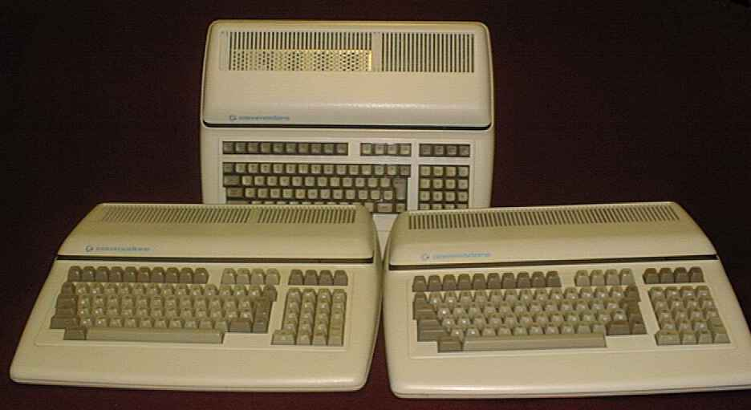

# CBM-II for [MiSTer](https://github.com/MiSTer-devel/Main_MiSTer/wiki)

MiSTer FPGA core for the [Commodore CBM-II line of 8-bit computers](http://www.6502.org/users/sjgray/computer/cbm2/)
(aka. PET-II, P128, B128, B256, P500/B600/B700 series)

## Core Features

* Business (80-column monochrome) and Professional (40 column colour with VIC-II) models
* 128kB, 256kB or full memory (~1MB) options
* VIC-II (P500 model) or 6545 CRTC (P600/P700 models) video
* SID audio
* Predefined and custom model configurations
* Direct file injection (*.PRG)
* Joystick/paddle/mouse support (B500 model)
* 4040/8250 IEEE disk drives (supporting D64, D80 and D82 disk images)
* Optional external RAM in segment 15.
* Optional external ROM at location $2000, $4000 and $6000 in segment 15.
* External IEC through USER_IO port (requires modified kernal or external ROM)

## Acknowlegements

This core could not exist without the following projects:

* The MiSTer project
* T65, (c) 2002-2015 Daniel Wallner, Mike Johnson, Wolfgang Scherr, Morten Leikvoll
* VIC-II, from FPGA64 by Peter Wendrich (pwsoft@syntiac.com)
* MC6845, from BBC Micro for Altera DE1 (c) 2011 Mike Stirling
* SID, from C64_MiSTer by Sorgelig
* VIA6522, by Gideon Zweijtzer \<gideon.zweijtzer@gmail.com\>
* MOS6526, by Rayne
* M6532, from k7800 (c) by Jamie Blanks
* MOS6551, from CoCo3FPGA (c) 2008 Gary Becker (gary_l_becker@yahoo.com)
* C1351 Mouse, from C64_MiSTer by Sorgelig

Most of these projects include changes contributed by other authors.
See the source code for the full copyright notices.
